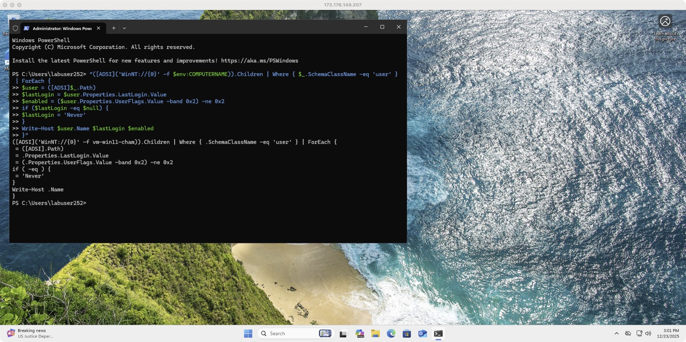
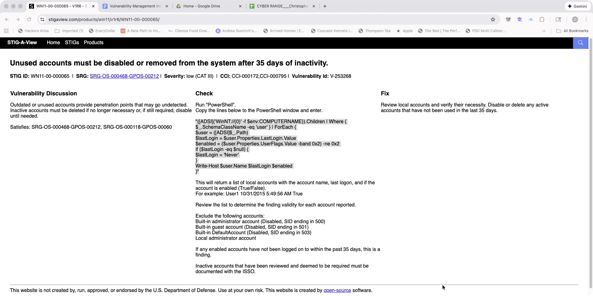
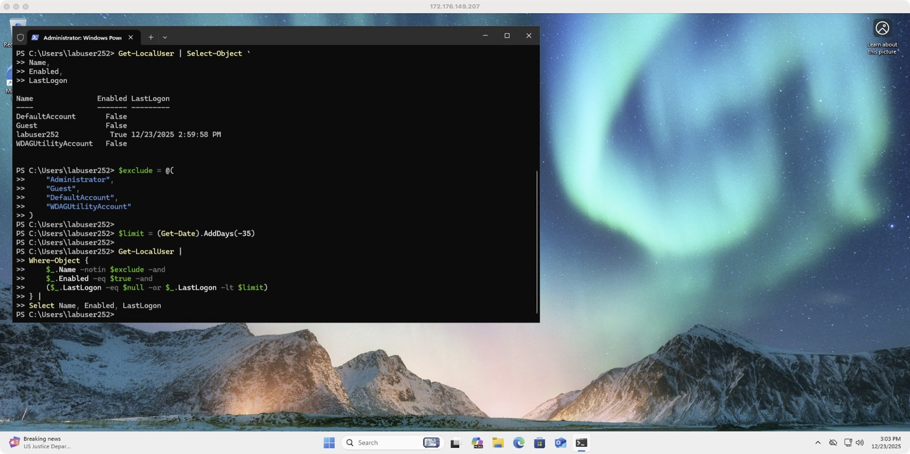

# Windows 11 STIG Compliance – V-253268 (WN11-00-000065)
Inactive Local Accounts (35-Day Rule)

## Overview
This repository documents validation of **DISA STIG WN11-00-000065 / V-253268**, which requires unused local accounts to be **disabled or removed after 35 days of inactivity**.

This lab demonstrates a modern, reliable compliance approach on **Windows 11** using PowerShell and authoritative account data.

---

## STIG Details
- STIG ID: WN11-00-000065
- Vulnerability ID: V-253268
- Severity: CAT III (Low)
- Requirement: Enabled local accounts must not remain inactive for more than 35 days

---

## Why This Approach
Legacy STIG scripts rely on ADSI `LastLogin`, which is unreliable on Windows 10 and Windows 11.  
This project uses **Get-LocalUser**, which auditors accept as authoritative.

---

## Environment
- Operating System: Windows 11
- Privileges: Local Administrator
- Tooling: PowerShell

---

## Evidence Screenshots

### 1. Legacy ADSI-Based STIG Check (Unreliable on Windows 11)

This screenshot shows the legacy ADSI-based STIG check executing without errors but returning no usable account data due to deprecated `LastLogin` behavior on Windows 11.

---

### 2. STIG Viewer Reference (WN11-00-000065)

This screenshot shows the official STIG Viewer requirement and the legacy check method published by DISA for identifying inactive local accounts.

---

### 3. Authoritative Compliance Evidence Using Get-LocalUser

This screenshot confirms:
- Built-in accounts are disabled
- Only one enabled local account exists
- The enabled account logged in within the last 35 days
- No inactive enabled accounts were found

Status: **Not a Finding**

---

## Compliance Script

A reusable PowerShell compliance script is included:

```text
scripts/Check-WN11-00-000065.ps1
